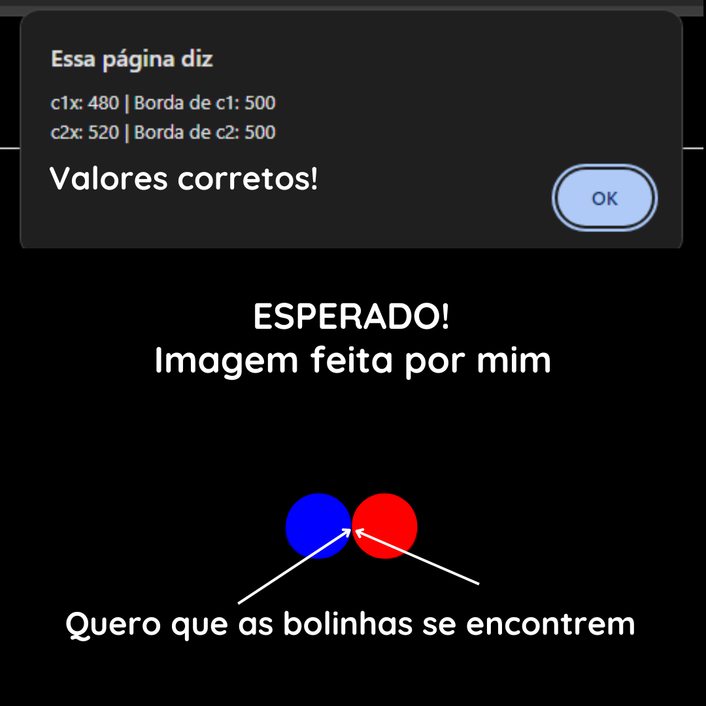
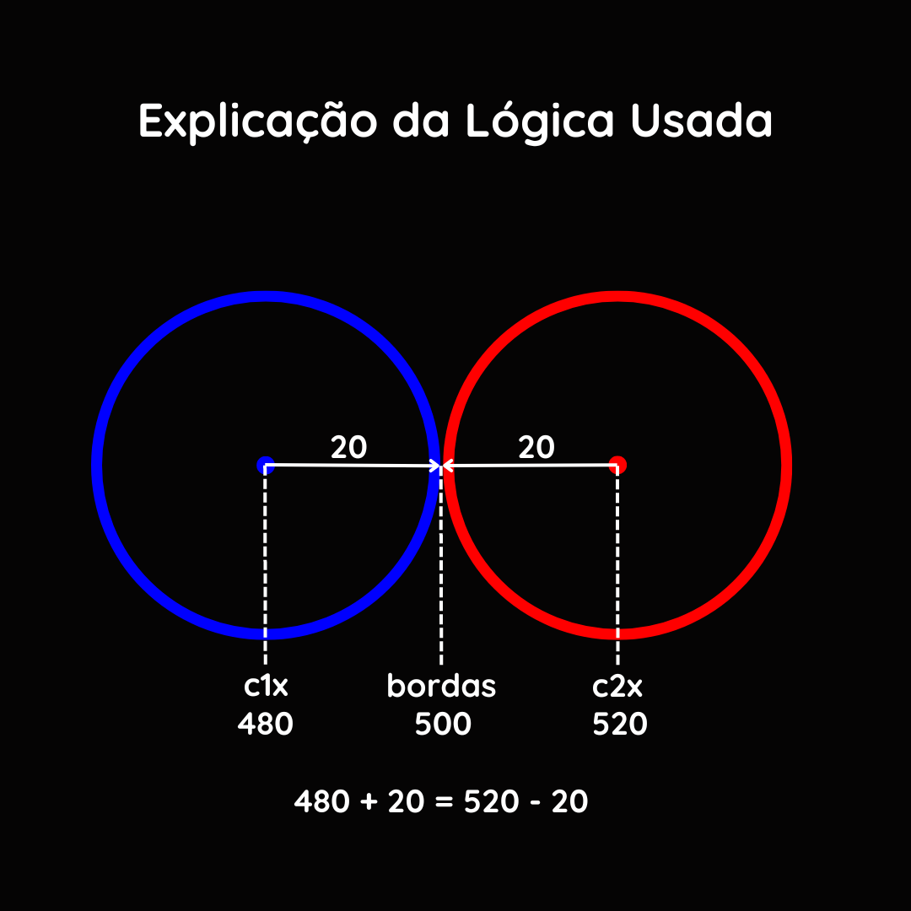

# Colisão de Células
### Programa que anima duas células e mostra quando elas colidem

## Problema:

O programa acusa que elas se colidiram e mostra os valores das suas posições de acordo com o esperado, mas a imagem mostrada na tela não fica de acordo com o esperado.

## Imagem explicativa

## Teste você mesmo no link:

[Link da simulação](https://jeiversonchristian.github.io/colisao_celulas/)